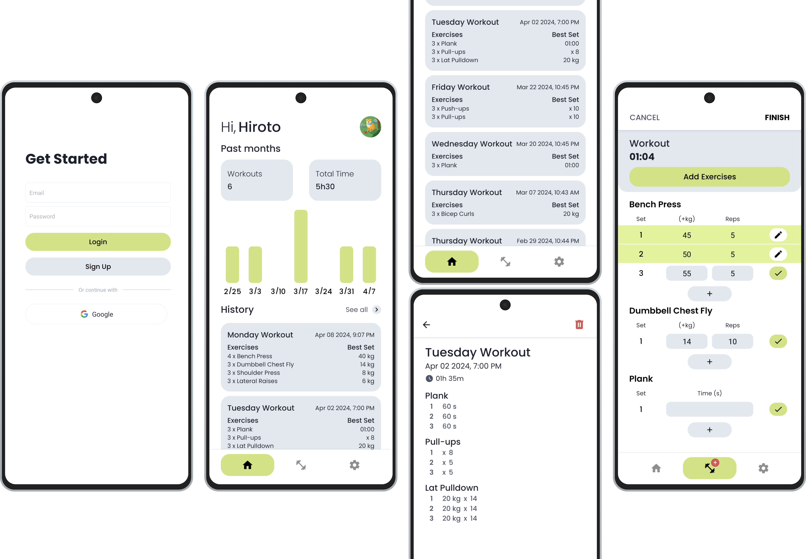
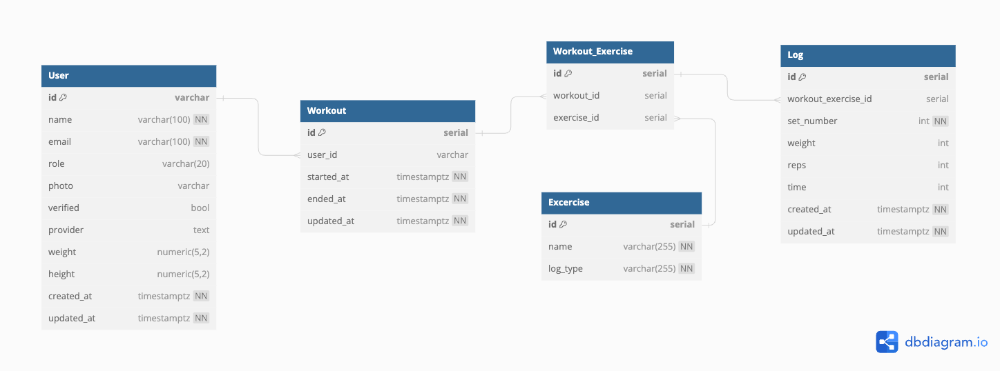

<p align="center">
  
  <div align="center">A Mobile app companion for your workouts. Built with React Native, Expo</div>
</p>

---

<!-- <p align="center">
  <a href="">
    
  </a>
</p> -->

- **React Native version**: 0.71
- **Supported iOS versions**: 13.0+
- **Supported Android versions**: 5.0+

## Demo

## Features
- Keep records of exercises, number of sets, weights, reps, etc. in each workout performed.
- See progress of your workouts and habits at a glance.
- Login/Signup using email or Google.

## Built with
Client:
- TypeScript, React Native, Expo
- Firebase Authentication
- Redux

Backend:
- Golang, Gin
- Postgresql, Gorm
- Firebase Authentication, Google OAuth

Deployment:
- Client App -> Expo Application Services
- Web App, Database -> Fly.io

<p align="center">
  
</p>

## ER Diagram
<p align="center">
  
</p>

## Local
Backend:
```
docker-compose build
docker-compose up
```
Client (Android):
```
yarn android
```
- in case of crashes, run from ./android:
```
./gradlew clean
```

### Production
Client (Android):
```
eas build --platform android
```
- for more info: https://docs.expo.dev/build/setup/#an-expo-user-account
